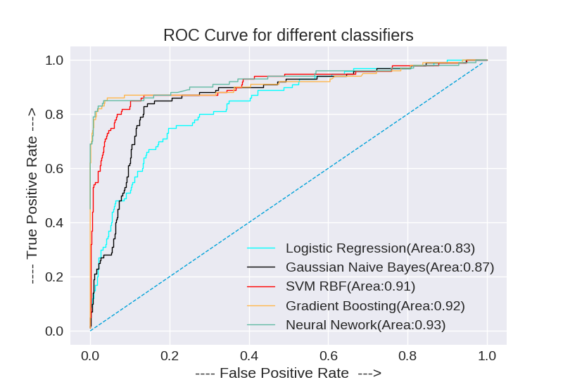
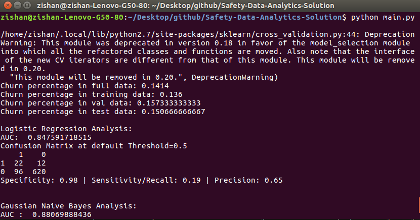

# Safety-Data-Analytics-Solution

This is the solution to the Problem Statement(PS.pdf) given in Safety Data Analytics, Great Step 2017. Proper solution is explained in presentation file(teamdotai.ppt).



## Getting Started

These instructions will get you a copy of the project up and running on your local machine for development and testing purposes.

### Prerequisites


* [Numpy](http://www.numpy.org/) - Multidimensioanl Mathematical Computing 
* [Sciki-Learn](http://scikit-learn.org/stable/install.html) - Machine Learning Models
* [Matplotlib](https://matplotlib.org/contents.html) - Used to plot Graph
* [Pandas](http://pandas.pydata.org/pandas-docs/version/0.18.0/) - Used to load dataset

### Installing

Clone the repository

```
git clone https://github.com/zishansami102/Safety-Data-Analytics-Solution
```
Move into the required directory and then run the following command to start preprocessing the given dataset

```
python preprocess.py
```
After the preprocessing is done, run the following command to start the analysis

```
python main.py
```

Output:

